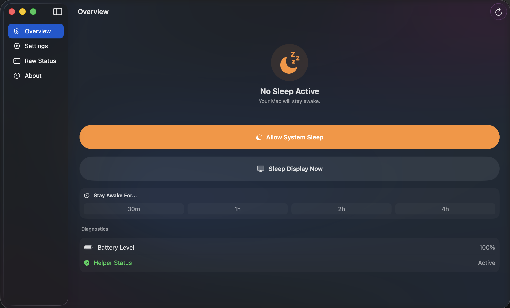
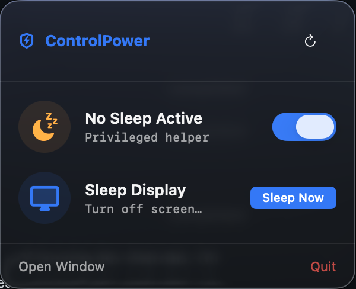

  

# ControlPower

ControlPower keeps your Mac awake from the menu bar. It is made for MacBooks running lid-closed and desktop Macs like iMacs that should keep working while the display is fully off.

[Download the latest notarized DMG](https://github.com/mohkg1017/ControlPower/releases/latest)

  

  

Perfect for MacBooks and iMacs: keep the Mac running, turn the display fully off instead of merely dimming it, and customize the sleep behavior for how you actually use the machine.

Built for the lid-closed workflow that generic keep-awake apps can still struggle with: your Mac stays awake after the lid closes, while the display turns fully off.

## Features

- Keep your Mac awake after closing the lid.
- Turn the display fully off while the Mac stays running.
- Toggle `disablesleep` with one click from the menu bar.
- Customize sleep-related settings without opening Terminal.
- Restore safe defaults for `disablesleep` and `lidwake`.
- Uses a signed helper for system-level changes.

## Requirements

- macOS 26.0 or later
- Apple silicon or Intel Mac

## Install

1. Download `ControlPower-1.0.0.dmg` from the latest release.
2. Open the DMG and drag ControlPower into Applications.
3. Launch ControlPower and approve the helper when macOS asks.

## Privacy

ControlPower does not collect analytics or user data. The release pipeline checks the app and DMG before upload so local files, credentials, and private machine paths are not accidentally shipped.
